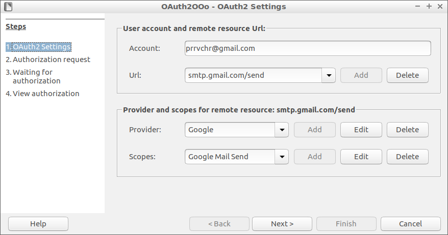
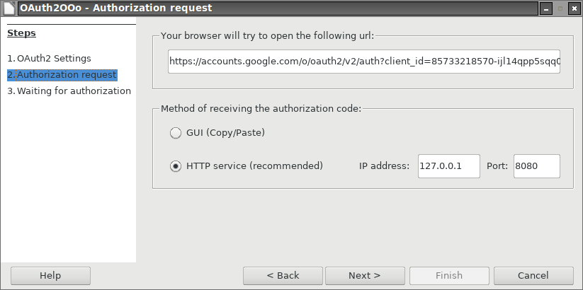
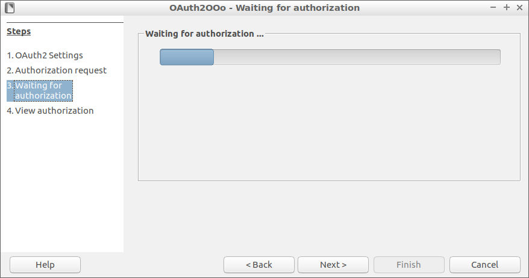
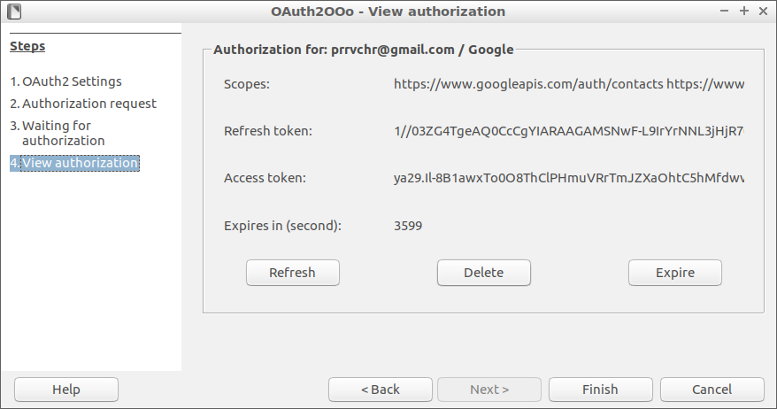

**This [document](https://prrvchr.github.io/OAuth2OOo) in English.**

**L'utilisation de ce logiciel vous soumet à nos** [**Conditions d'utilisation**](https://prrvchr.github.io/OAuth2OOo/OAuth2OOo/registration/TermsOfUse_fr) **et à notre** [**Politique de protection des données**](https://prrvchr.github.io/OAuth2OOo/OAuth2OOo/registration/PrivacyPolicy_fr).

# version [0.0.5](https://prrvchr.github.io/OAuth2OOo/README_fr#historique)

## Introduction:

**OAuth2OOo** fait partie d'une [Suite](https://prrvchr.github.io/README_fr) d'extensions [LibreOffice](https://fr.libreoffice.org/download/telecharger-libreoffice/) et/ou [OpenOffice](https://www.openoffice.org/fr/Telecharger/) permettant de vous offrir des services inovants dans ces suites bureautique.  
Cette extension est l'implémentation du protocole OAuth 2.0. Protocole permettant d'obtenir votre consentement pour qu'une application puisse accéder à vos données présentes chez les GAFA.

Etant un logiciel libre je vous encourage:
- A dupliquer son [code source](https://github.com/prrvchr/OAuth2OOo).
- A apporter des modifications, des corrections, des ameliorations.
- D'ouvrir une [issue](https://github.com/prrvchr/OAuth2OOo/issues/new) si nécessaire.

Bref, à participer au developpement de cette extension.
Car c'est ensemble que nous pouvons rendre le Logiciel Libre plus intelligent.

## Uno OAuth2.0 API pour LibreOffice / OpenOffice.

Le protocole OAuth2.0 permet la connexion aux ressources de serveurs, après acceptation de l'autorisation de connexion, par échange de jetons.

La révocation a lieu dans la gestion des applications associées à votre compte.

Plus aucun mot de passe n'est stocké dans LibreOffice / OpenOffice.

## Installation:

Il semble important que le fichier n'ait pas été renommé lors de son téléchargement.  
Si nécessaire, renommez-le avant de l'installer.

- Installer l'extension [OAuth2OOo.oxt](https://github.com/prrvchr/OAuth2OOo/raw/master/OAuth2OOo.oxt) version 0.0.5.

- Redémarrez LibreOffice / OpenOffice après l'installation.

## Utilisation:

Cette extension n'est pas faite pour être utilisée seule, mais fournit le service OAuth2 à d'autres extensions LibreOffice / OpenOffice.  
Voici comment nous utilisons son API:

### Créer le service OAuth2:

> identifier = "com.gmail.prrvchr.extensions.OAuth2OOo.OAuth2Service"  
> service = ctx.ServiceManager.createInstanceWithContext(identifier, ctx)

### Initialiser la Session ou au moins l'Url:

- Initialiser la Session: 

> initialized = service.initializeSession(registered_url, user_account)

- Initialiser l'Url:

> initialized = service.initializeUrl(registered_url)

La valeur renvoyée:: `initialized` est True si `registered_url` et/ou `user_account` a été récupérée de la configuration du service OAuth2.

### Obtenir le jeton d'accès:

> format = 'Bearer %s'  
> token = service.getToken(format)

## A été testé avec:

* LibreOffice 6.4.4.2 - Ubuntu 20.04 -  LxQt 0.14.1

* LibreOffice 7.0.0.0.alpha1 - Ubuntu 20.04 -  LxQt 0.14.1

* OpenOffice 4.1.5 x86_64 - Ubuntu 20.04 - LxQt 0.14.1

* OpenOffice 4.2.0.Build:9820 x86_64 - Ubuntu 20.04 - LxQt 0.14.1

* LibreOffice 6.1.5.2 - Raspbian 10 buster - Raspberry Pi 4 Model B

* LibreOffice 6.4.4.2 (x64) - Windows 7 SP1

Je vous encourage en cas de problème :-(  
de créer une [issue](https://github.com/prrvchr/OAuth2OOo/issues/new)  
J'essaierai de la résoudre ;-)

## Historique:

### Ce qui a été fait pour la version 0.0.5:

- Ecriture d'une nouvelle interface [XWizard](https://github.com/prrvchr/OAuth2OOo/blob/master/python/wizard.py) afin de remplacer le service Wizard devenu défectueux avec les versions 6.4.x et 7.x de LibreOffice (voir [bug 132110](https://bugs.documentfoundation.org/show_bug.cgi?id=132110)).

    Cette nouvelle interface corrige également le [bug 132661](https://bugs.documentfoundation.org/show_bug.cgi?id=132661) et le [bug 132666](https://bugs.documentfoundation.org/show_bug.cgi?id=132666) et permet d'accéder aux versions 6.4.x et 7.x de LibreOffice...

    De plus, ce nouveau XWizard ajoute de nouvelles fonctionnalités telles que:

    - Redimensionnement automatique de l'assistant aux dimensions de la première page affichée.
    - Déplacement automatique vers la page X à l'ouverture si possible.

- Correction d'un problème avec les jetons sans expiration (tels qu'utilisés par Dropbox) lors du test de leur validité...

- Beaucoup d'autres correctifs...

### Que reste-t-il à faire pour la version 0.0.5:

- Ecriture de l'implémentation du bouton Aide (CommandButton5) dans la nouvelle interface [XWizard](https://github.com/prrvchr/OAuth2OOo/blob/master/python/wizard.py).

- Ajouter de nouvelles langue pour l'internationalisation...

- Tout ce qui est bienvenu...
